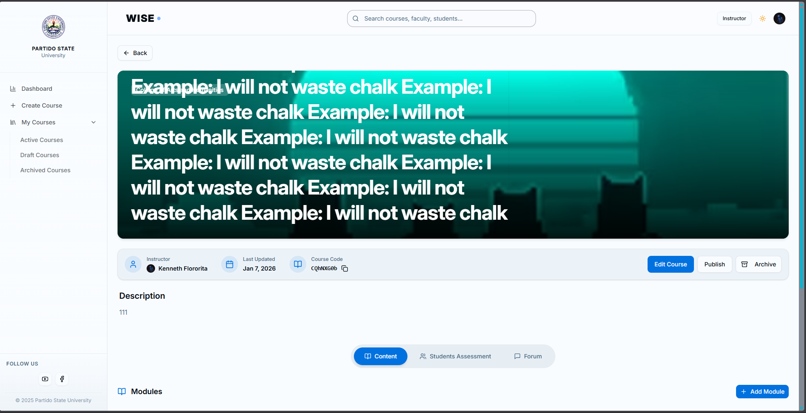

# 🎓 WISE (Web-based Institutional System for Education) - QA Portfolio

## 📝 Project Overview
**Role:** Manual QA Tester
**System:** WISE is an institutional management system allowing Admins, Instructors, and Students to manage enrollments, courses, and grades.

This repository documents the **Quality Assurance (QA)** process I performed on the system, focusing on Functional, Boundary, and API-level testing.

---

## 📂 Test Artifacts (Deliverables)
| Artifact | Description |
| :--- | :--- |
| 📊 **[Test Execution Logs (Excel)](./test-cases/WISE%20(Web-based%20Institutional%20System%20for%20Education)%20-%20QA%20Test%20Execution%20Logs.xlsx)** | Comprehensive test script covering **10+ scenarios** including Happy Path, Negative, and Edge Cases. |
| 🐞 **[Jira Defect Board](./Jira-defects/Jira-defects.png)** | Kanban board used to track the Defect Life Cycle from "New Bug" to "Verified". |

---

## 🛠️ Testing Scope & Techniques
I utilized **Black Box** and **Gray Box** testing methodologies to verify system stability.

* **Functional Testing:** Verified core modules (Login, Course Creation, Enrollment).
* **Boundary Analysis:** Tested input limits (e.g., Course Titles > 255 chars).
* **API Validation:** Used Chrome DevTools to verify HTTP 400/500 status codes during failures.
* **Negative Testing:** Verified system behavior against invalid URLs and empty payloads.

---

## 🐛 Defect Highlights
I identified and documented critical defects that impacted system usability.

### 🔴 Critical Bug: Server Upload Failure (HTTP 400)
* **Issue:** Instructor cannot upload video materials via Server 2 which is powered by YouTube Unlisted.
* **Noted Cause:** The server returns a `400 Bad Request` when the payload is sent.
* **Impact:** Instructors are blocked from sharing course materials.
* **Evidence:**

### 🟠 Major Bug: Data Integrity (Character Limits)
* **Issue:** The "Course Title" field accepts 1,000+ characters without validation.
* **Impact:** Causes UI breakage and potential database overflow.
* **Test Technique:** Boundary Value Analysis.
* **Evidence:**

---

## 🧰 Tools Used
* **Test Management:** Google Sheets (Scripting), Jira (Defect Tracking)
* **Version Control:** Git & GitHub
* **API Debugging:** Chrome Network Tab
